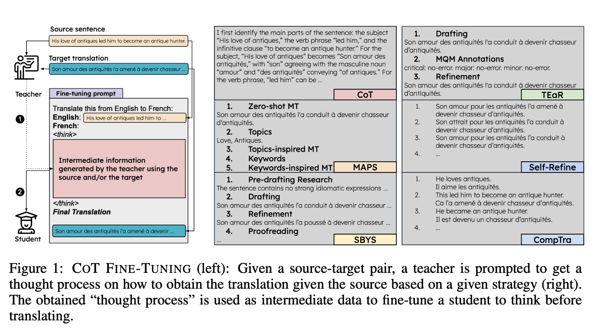

# Official Repo of "LLM Resoning for MT"

Official implementation of [LLM Reasoning for Machine Translation: Synthetic Data Generation over Thinking Tokens](https://arxiv.org/abs/2510.11919) with code, prompts and model outputs. We also release all the datasets we have used, here are the main collections:
- [ToPXGen Llama-4-Scout-17B-16E-Instruct](https://huggingface.co/collections/almanach/topxgen-llama-xhosa-thinking-68e783ad2a516eddcc1cffe3)
- [WMT19 Gemma-3-27b-it](https://huggingface.co/collections/almanach/wmt19-lithuanian-thinking-68e7789566a0f90d4e3c4f51)


# Table of Contents

- [Overview](#overview)
- [Installation](#installation)
- [Experiments](#experiments)
  - [Dataset Generation](#dataset-generation)
  - [Training](#training)
    - [Supervised Fine-tuning](#supervised-fine-tuning)
    - [GRPO](#grpo)
  - [Evaluation](#evaluation)
- [Contributions](#contributions)
- [Aknowledgements](#aknowledgements)
- [Citations](#citations)
  

# Overview



In this paper, we investigate fine-tuning LLM for MT so that they produce intermediate tokens before the final translation. For this purpose, we use a parallel dataset $\mathcal{D}$ and a teacher model $\mathbb{IT}$ to produce intermediate tokens and fine-tune a student $m$ on the obtained data. Specifically, given a source-target pair $(x, y)$, we prompt $\mathbb{IT}$ to produce intermediate information (typically a thought process) $r$ (linking $x$ to $y$) and we fine-tune $m$ to produce the reasoning and the target given the source $\left (i.e. p(y, r|x) \right)$. The are many ways of obtaining intermediate tokens, we consider 2 setups:

- $\textbf{CoT Prompting}$. We use a CoT prompt and ask the teacher to explain step by step how to reach the provided target given the source. The idea here is to make the teacher act like a human translator that is trying to translate the source and produce a reasoning that we will fine-tune the student on. This is analogous to $\textit{CoT distillation}$ which is already ubiquitous when dealing with reasoning tasks.
- $\textbf{Stepwise prompting strategies for MT}$. Rather than using CoT prompting, we adopt stepwise prompting strategies for MT. These approaches decompose translation into successive stages, each guided by a specific prompt that contributes to the final output. The intermediate results from all steps are concatenated into a single text, which we use as intermediate information ($r$).

Once we have our "extended" dataset $\{(x_i, r_i, y_i)\}_{i=1}^{|\mathcal{D}|}$ we can perform $\textbf{CoT fine-tuning} (CoTFT)$ whereby the model produce $r$ followed by $y$ given a source $x$. We compare it to the standard $\textbf{Input-Output fine-tuning} (IOFT)$ where the model is trained to directly produce the translation without prior reasoning.

For $\textbf{CoT prompting}$, we consider 6 different templates, each reflecting a different strategy used to perform MT as introduced by [MT-R1-Zero](https://arxiv.org/pdf/2504.10160). For stepwise prompting strategies, we consider: [MAPS](https://arxiv.org/abs/2305.04118), [SBYS](https://arxiv.org/abs/2409.06790), [TEaR](https://arxiv.org/abs/2402.16379), [Self-Refine](https://arxiv.org/abs/2306.03856) and [CompTra](https://arxiv.org/abs/2503.04554).

# Installation

This repository heavily relies on [ToPXGen's repository](https://github.com/ArmelRandy/topxgen). The most important dependencies are [vLLM](https://github.com/vllm-project/vllm) for inference and [Transformers](https://github.com/huggingface/transformers) for training. Some experiments might require to use [SONAR](https://github.com/facebookresearch/SONAR) and/or [BLASER](https://huggingface.co/facebook/blaser-2.0-qe).

# Experiments

## Dataset Generation

In the paper, we mainly work with Xhosa. We use the [parallel dataset](https://huggingface.co/datasets/almanach/topxgen-llama-4-scout-and-llama-4-scout) built by applying the ToPXGen pipeline to [Llama-4-Scout-17B-16E-Instruct](https://huggingface.co/meta-llama/Llama-4-Scout-17B-16E-Instruct). This model has the advantage of being good at generating Xhosa, at least better than [gemma-3-27b-it](https://huggingface.co/google/gemma-3-27b-it) which was used in the [first ToPXGen dataset released.](https://huggingface.co/datasets/almanach/topxgen-gemma-3-27b-and-nllb-3.3b)

In the paper, we consider multiple potential teachers: Llama-4-Scout-17B-16E-Instruct, gemma-3-27b-it and [DeepSeek-R1-Distill-Llama-70B](https://huggingface.co/deepseek-ai/DeepSeek-R1-Distill-Llama-70B). The generation code takes as input as $\textbf{JSONL}$ file where each line is a dictionary with 2 keys: `sentence`  (a sentence in Xhosa), `translation` (its translation in English). Given a strategy, the model produce the intermediate information for each pair source-target of the dataset.

```bash
python\
    paraphrase.py\
    --strategy maps\
    --model_name_or_path google/gemma-3-27b-it\
    --tokenizer_name_or_path google/gemma-3-27b-it\
    --inference_api vllm\
    --api_key <YOUR_API_KEY_IF_OAI/ANT/COH>\
    --request_batch_size 2048\
    --seed 122\
    --max_new_tokens 2000\
    --temperature 0.0\
    --top_p 1.0\
    --repetition_penalty 1.0\
    --num_return_sequences 1\
    --num_beams 1\
    --verbose\
    --languages Xhosa\
    --input_filenames Xhosa.jsonl\
    --input_dir /path/to/the/folder\
    --source_language English\
    --number_of_demonstrations 5\
```

Some strategies require additional arguments, `cot_template` (from 1 to 6) for CoT distillation and `--number_of_generations_per_step` for self-refine (number of iterative refinement) and paraphrasing. We release the datasets used in our experiments:

- **ToPXGen LLaMA-4**
  - *Llama-4-Scout-17B-16E-Instruct*:
    - **CoT**: https://huggingface.co/datasets/almanach/topxgen-llama-4-scout-CoT
    - **MAPS**: https://huggingface.co/datasets/almanach/topxgen-llama-4-scout-MAPS
    - **SBYS**: https://huggingface.co/datasets/almanach/topxgen-llama-4-scout-SBYS
    - **Refine**: https://huggingface.co/datasets/almanach/topxgen-llama-4-scout-REFINE
    - **TEaR**: https://huggingface.co/datasets/almanach/topxgen-llama-4-scout-TEaR
    - **CompTra**: https://huggingface.co/datasets/almanach/topxgen-llama-4-scout-CompTra
    - **BoA**: https://huggingface.co/datasets/almanach/topxgen-llama-4-scout-BoA
    - **Decomposition**: https://huggingface.co/datasets/almanach/topxgen-llama-4-scout-Decomp
  - *gemma-3-27b-it*
    - **MAPS**: https://huggingface.co/datasets/almanach/topxgen-gemma-3-27b-it-MAPS
    - **SBYS**: https://huggingface.co/datasets/almanach/topxgen-gemma-3-27b-it-SBYS
    - **Refine**: https://huggingface.co/datasets/almanach/topxgen-gemma-3-27b-it-REFINE
    - **TEaR**: https://huggingface.co/datasets/almanach/topxgen-gemma-3-27b-it-TEaR
    - **CompTra**: https://huggingface.co/datasets/almanach/topxgen-gemma-3-27b-it-CompTra
    - **BoA**: https://huggingface.co/datasets/almanach/topxgen-gemma-3-27b-it-BoA
  - *DeepSeek-R1-Distill-Llama-70B*:
    - **CoT**: https://huggingface.co/datasets/almanach/topxgen-deepseek-r1-distill-llama-70b-CoT
  - *gemma-3-4b-it*
    - **MAPS**: https://huggingface.co/datasets/almanach/topxgen-gemma-3-4b-it-MAPS
    - **SBYS**: https://huggingface.co/datasets/almanach/topxgen-gemma-3-4b-it-SBYS
    - **Refine**: https://huggingface.co/datasets/almanach/topxgen-gemma-3-4b-it-REFINE
    - **TEaR**: https://huggingface.co/datasets/almanach/topxgen-gemma-3-4b-it-TEaR
    - **CompTra**: https://huggingface.co/datasets/almanach/topxgen-gemma-3-4b-it-CompTra
- **WMT19**
  - *gemma-3-27b-it*
    - **CoT**: https://huggingface.co/datasets/almanach/wmt19-gemma-3-27b-it-CoT
    - **MAPS**: https://huggingface.co/datasets/almanach/wmt19-gemma-3-27b-it-MAPS
    - **SBYS**: https://huggingface.co/datasets/almanach/wmt19-gemma-3-27b-it-SBYS
    - **Refine**: https://huggingface.co/datasets/almanach/wmt19-gemma-3-27b-it-REFINE
    - **TEaR**: https://huggingface.co/datasets/almanach/wmt19-gemma-3-27b-it-TEaR
    - **CompTra**: https://huggingface.co/datasets/almanach/wmt19-gemma-3-27b-it-CompTra
    - **BoA**: https://huggingface.co/datasets/almanach/wmt19-gemma-3-27b-it-BoA
    - **Decomposition**: https://huggingface.co/datasets/almanach/wmt19-gemma-3-27b-it-Decomp

All these datasets are fairly easy to use, the split name is indicative of the content (e.g. CoT_T1, CoT_T2 for CoT prompting templates). The column `source` corresponds to a source sentence in English, `translation` is its translation. These 2 columns alone suffice to perform IOFT. `target` is the column in which the translation is preceded by a the reasoning (e.g. *\<think>\n...\n\</think>\n\nFinal Translation\n`translation`*). You can use it for CoTFT. `better-translation` (when present) is the translation with the highest BLASER score between the ground truth `translation` and those generated by the MT prompting strategy considered. `better-target` is analogous to `target` but with `better-translation` instead of `translation`. Here is a recap:
- Fine-tuning on `sentence`, `translation`: **IOFT**
- Fine-tuning on `sentence`, `target`: **CoTFT**
- Fine-tuning on `sentence`, `better-translation`: **IOFT-Max**
- Fine-tuning on `sentence`, `better-target`: **CoTFT-Max**

## Training

### Supervised Fine-tuning

For **SFT**, you can use any dataset above by providing its path on the hub, the input column name and the target column name via the arguments `dataset_name_or_path` (`split`, `size_valid_set`), `input_column_name`, `output_column_name`. You can use the following command to IOFT [gemma-3-4b-pt](https://huggingface.co/google/gemma-3-4b-pt) on the ToPXGen LLaMA dataset.

```bash
python\
  train.py\
  --model_name_or_path google/gemma-3-4b-pt\
  --tokenizer_name_or_path google/gemma-3-4b-pt\
  --dataset_name_or_path almanach/topxgen-llama-4-scout-and-llama-4-scout\
  --size_valid_set 1000\
  --split Xhosa\
  --input_column_name source\
  --output_column_name target\
  --max_length 512\
  --max_steps 5000\
  --per_device_train_batch_size 4\
  --per_device_eval_batch_size 4\
  --gradient_accumulation_steps 4\
  --lora_r 32\
  --lora_alpha 64\
  --lora_dropout 0.05\
  --target_modules q_proj k_proj v_proj o_proj gate_proj up_proj down_proj\
  --learning_rate 1e-5\
  --lr_scheduler_type constant_with_warmup\
  --min_learning_rate 5e-6\
  --num_warmup_steps 500\
  --weight_decay 0.01\
  --bf16\
  --seed 122\
  --output_dir .../checkpoints-gemma-3-4b-xho\
  --logging_steps 100\
  --eval_steps 200\
  --save_steps 200\
  --src English\
  --target_languages Xhosa\
  --dataset_size -1\
  --strategy soonest\
  --targets_only\
  --data_dir /path/to/directory/containing/the/data\
  --gradient_checkpointing\
  --test_size_ratio 1000\
  --use_flash_attn\
```

For **CoTFT with MAPS** for instance, you can use [almanach/topxgen-llama-4-scout-MAPS](https://huggingface.co/datasets/almanach/topxgen-llama-4-scout-MAPS) instead and adapt the training parameters: `--max_length 2048` and `--gradient_accumulation_steps 8`. If you want to use your newly generated dataset, you'll have to add the path to the folder where it is (via `data_dir`) and set `dataset_name_or_path` to the prompting strategy used (e.g. cot, maps, sbys etc.). The correct reading function will be called in [train_datasets.py](train_datasets.py#L368). In both cases, `size_valid_set` and `test_size_ratio` respectively are used to build a validation set. `--use_peft` indicates that you'll use LoRA and requires you to set the relevant arguments (`--lora_r`, `--lora_alpha`, `lora_dropout` and `--target_modules`).

### GRPO

For **GRPO**, the setup is almost the same as **SFT**'s and you only need a dataset with a `sentence` column and its `translation` column (e.g. [almanach/Xhosa](https://huggingface.co/datasets/almanach/Xhosa)). These are enough to compute the reward functions we consider for the training. The training file is the same, GRPO just requires more arguments and more importantly you should add `--use_grpo` to your command.  We recommend using PEFT (`--use_peft`), which was recently shown to perform similarly to full fine-tuning for RL fine-tuning. Here is an example:

```bash
GPUS_PER_NODE=4
accelerate launch\
  --main_process_port $MASTER_PORT\
  --config_file ...configs/deepspeed_zero3_multi.yaml\
  --num_processes=$(($GPUS_PER_NODE - 1))\
  train.py\
  --model_name_or_path /.../checkpoints-gemma-3-4b-xho/checkpoint-5000\
  --tokenizer_name_or_path gemma-3-4b-pt\
  --dataset_name_or_path almanach/Xhosa\
  --split Xhosa\
  --size_valid_set 100\
  --input_column_name source\
  --output_column_name target\
  --max_length 512\
  --max_steps 5000\
  --per_device_train_batch_size 4\
  --per_device_eval_batch_size 4\
  --gradient_accumulation_steps 4\
  --lora_r 32\
  --lora_alpha 64\
  --lora_dropout 0.05\
  --target_modules q_proj k_proj v_proj o_proj gate_proj up_proj down_proj\
  --learning_rate 1e-6\
  --lr_scheduler_type constant_with_warmup\
  --num_warmup_steps 100\
  --weight_decay 0.01\
  --bf16\
  --seed 122\
  --output_dir .../checkpoints-gemma-3-4b-xho-grpo\
  --logging_steps 10\
  --eval_steps 2000\
  --save_steps 200\
  --src English\
  --target_languages Xhosa\
  --dataset_size -1\
  --strategy soonest\
  --targets_only\
  --gradient_checkpointing\
  --test_size_ratio 1000\
  --use_flash_attn\
  --temperature 1.0\
  --top_p 1.0\
  --repetition_penalty 1.00\
  --max_prompt_length 128\
  --max_completion_length 192\
  --num_generations 12\
  --generation_batch_size 48\
  --beta 0.02\
  --max_grad_norm 1.0\
  --use_liger_loss\
  --use_grpo\
  --use_peft\
```

CoTFT models require `--use_format_reward` and [`--use_comptra`](train.py#L1117) (if the model that is currently RL-finetuned was SFTed with *\<demonstrations>\</demonstrations>* instead of *\<think>\</think>*). `--max_completion_length` also needs to be increased (e.g. 1536) for CoTFT.

## Evaluation

To evaluate the generations of the fine-tuned models, we use [evaluation.py](evaluation.py). We make sure to use the same template for training and evaluation (i.e. [Template 14](comptra/prompts/templates.py#L189)) and generate translations for the benchmark of interest (FLORES, NTREX, TICO-19 etc.). We evaluate in zero-shot, with greedy decoding (beam size = 1).

```bash
python\
  evaluation.py\
  --model_name_or_path $MODEL_NAME_OR_PATH\
  --tokenizer_name_or_path $TOKENIZER_NAME_OR_PATH\
  --src $SRC\
  --tgt $TGT\
  --request_batch_size 64\
  --inference_api vllm\
  --max_samples 10000\
  --num_return_sequences 1\
  --num_beams 1\
  --max_new_tokens 2768\
  --temperature 0.0\
  --top_p 1.0\
  --repetition_penalty 1.0\
  --output_dir GENERATIONS/FLORES/GEMMA-3-4B/MAPS\
  --k $K\ # Number of ICL demos, 0 in our case
  --seed 122\
  --method_divide llm\
  --merge_prompt vanilla\
  --method_translate vanilla\
  --selection_method greedy\
  --steps 0\
  --verbose\
  --number_of_subproblems 0\
  --number_of_refining_steps 0\
  --template_key 14\ # Same as the training template
  --retriever_type bm25s\
  --dataset_name_or_path flores\
```

If the model was trained with LoRA, the following arguments should be added (the rank should be the same as the one used during training).

```python
    --base_model_name_or_path path/to/base/model\
    --lora_rank 32\
    --enable_lora\
```

You can evaluate your model with a command similar to [scripts/eval.sh](scripts/eval.sh)

# Contributions

It is easy to add a new prompting strategy for MT or decomposition prompt by following what is done in [paraphrase.py](paraphrase.py).

# Aknowledgements

This work was made possible by the INRIA Paris' NLP research team, [ALMAnaCH](https://almanach.inria.fr/index-en.html).

# Citations

Please cite the following if you use the data or code in this repository.

```
@misc{zebaze2025llmreasoningmachinetranslation,
      title={LLM Reasoning for Machine Translation: Synthetic Data Generation over Thinking Tokens}, 
      author={Armel Zebaze and Rachel Bawden and Benoît Sagot},
      year={2025},
      eprint={2510.11919},
      archivePrefix={arXiv},
      primaryClass={cs.CL},
      url={https://arxiv.org/abs/2510.11919}, 
}
```
